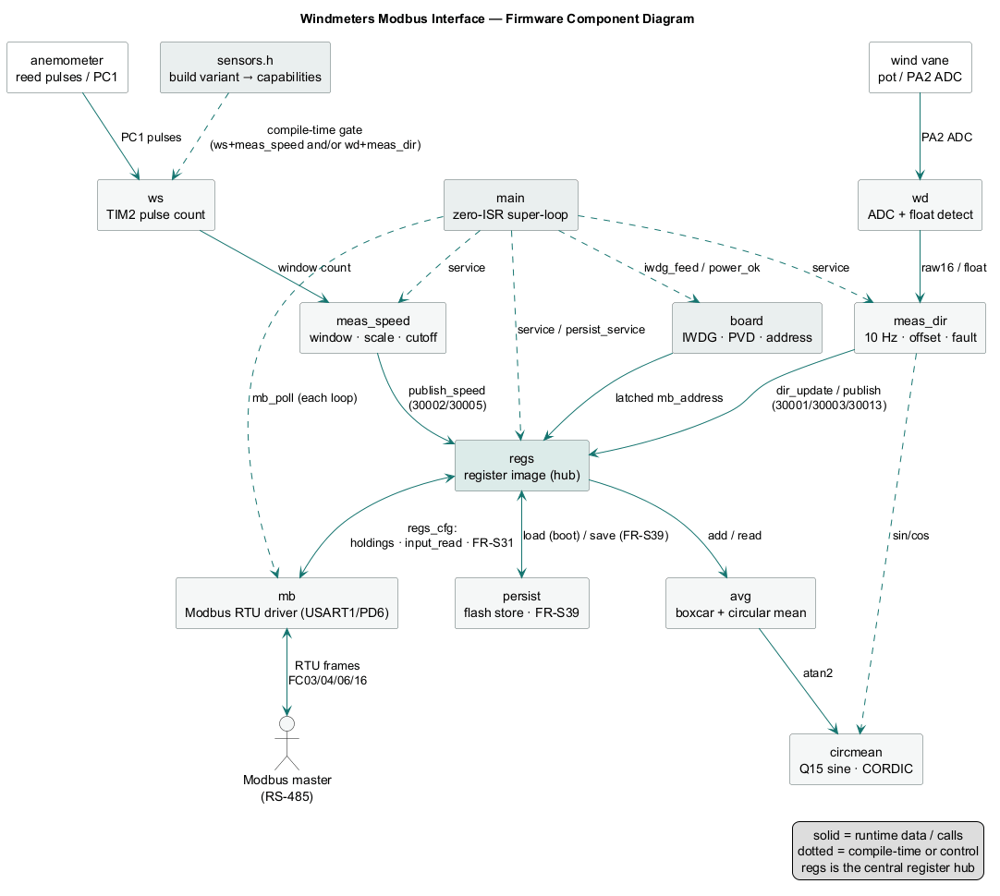
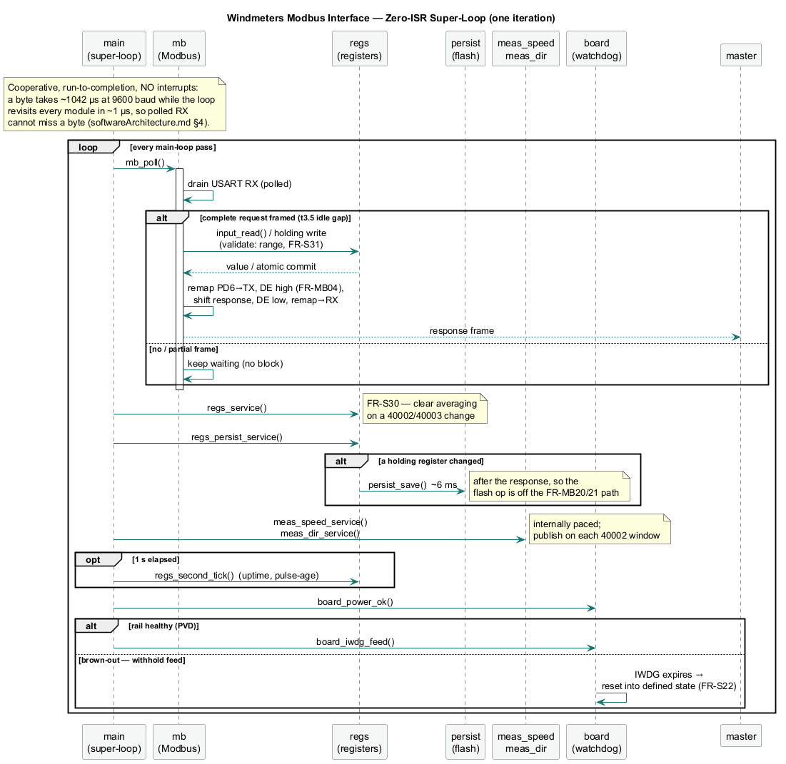
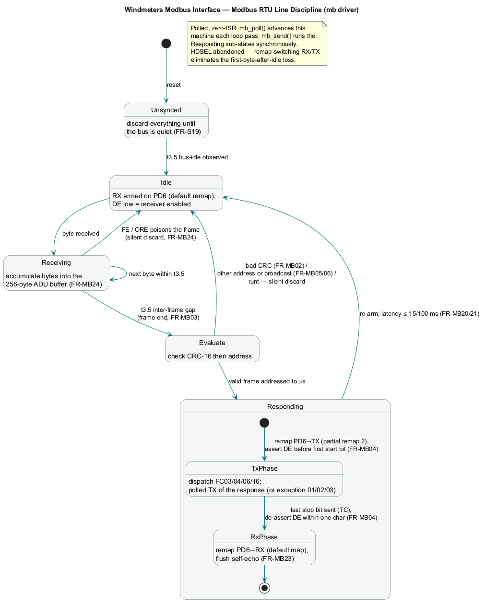

# Software Architecture — Windmeters Modbus Interface

| Field | Value |
|---|---|
| Document | Software architecture (design rationale) |
| Project | `windmeters-modbus-interface` firmware |
| Date | 2026-07-03 |
| Status | Agreed baseline for driver development and integration |
| Related docs | `design/TDS.md` v0.6 (requirements this design satisfies), `design/driverDevelopment.md` (drivers are written against this architecture), `design/scratchBook.md` |

## 1. Scope and constraints

Target: CH32V003J4M6 — RV32EC, one core, 48 MHz HSI, 16 KB flash, 2 KB SRAM.
One firmware source tree, two builds (wind speed / wind direction, FR-S01).

Given these constraints and the TDS requirements, the architecture is
**zero-interrupt: a cooperative super-loop polls everything.** No RTOS —
it would cost more RAM than the application uses and buys nothing here.

> **Amendment 2026-07-03 (phase-3 bench):** the original design used a
> USART RX ISR + SysTick ISR. On the bench, the RXNE ISR corrupted ~1/3 of
> received frames (missing/scrambled leading bytes, no USART error flags,
> wire verified pristine) — symptoms consistent with interrupt
> prologue/state corruption on this RV32EC toolchain path. Polled RX fixed
> it completely (26/26 matrix + 40/40 endurance). Since the main loop
> cycles in ~1 µs versus 1042 µs per byte at 9600 baud, polling is
> provably lossless and interrupts buy nothing. **Do not introduce ISRs in
> this project without first root-causing that failure** (suspect
> `__attribute__((interrupt))` code generation with ch32v003fun).

## 2. Structure

```
┌─ main loop (everything, run-to-completion, no ISRs) ────────┐
│ for(;;) {                                                   │
│   modbus_service();      // poll RXNE/errors, stamp ticks,  │
│                          // gap detect, parse, respond      │
│   measurement_service(); // window expiry, sample, publish  │
│   diagnostics_service(); // uptime, counters                │
│   IWDG_refresh();        // only here (FR-S20)              │
│ }                                                           │
└─────────────────────────────────────────────────────────────┘
   TIM2 (speed build): pure hardware counter — counts with zero code
   Timing: raw SysTick->CNT arithmetic (HCLK; FUNCONF_SYSTICK_USE_HCLK 1)
```

Initialization before the loop follows the FR-S18 order strictly:
PC2/DE low first → PC4 address latch → sensor front-end ready (ADC
self-calibration / TIM2 clear) → IWDG on → USART1 receiver enabled last.

*See §7 (below) for the component, super-loop sequence, and Modbus
state-machine diagrams.*

## 3. Key decisions and why

**Everything stateful lives in the main loop.** Modbus registers are written
by `measurement_service()` and read by `modbus_service()` — both in the same
sequential loop, so FR-S24's snapshot coherence is *structural*: no masking,
no double-buffering, no races, because there is no preemption between
producer and consumer. This is the single biggest simplification available,
and it is why measurement does **not** run in the SysTick ISR (superseding
the earlier scratchBook sketch that put it there).

**Frame boundary by polling, not a timer.** The main loop checks
`ms_tick - last_rx_tick ≥ 5` to detect the 3.5-character gap (FR-MB03). A
dedicated t3.5 timer interrupt is the textbook approach, but timers are
scarce (TIM2 is the pulse counter on the speed build), the loop iterates
thousands of times per millisecond, and the detection jitter this adds is
microseconds against a 100 ms budget (FR-MB20). One mechanism, both builds.

**Blocking TX from the main loop.** The longest response (~29 bytes) takes
~33 ms of wire time at 9600 baud. Sending it byte-by-byte with a poll on
TXE, then polling TC to drop DE within one character time (FR-MB04), is
simple and deterministic. It briefly stalls the loop, but well inside the
IWDG window, and Modbus is strictly request/response so nothing else can
arrive meanwhile — except the device's own looped-back bytes (HDSEL ties TX
to RX), which the RX ISR drops while the `transmitting` flag is set
(FR-MB23).

**No ADC interrupt, no TIM2 interrupt.** Direction build: every 100 ms the
main loop takes 16 blocking conversions (< 1 ms total at the ≥71-cycle
sample time) and folds them per FR-S28. Speed build: TIM2 counts in
hardware; at window expiry the main loop reads CNT, checks the overflow
flag UIF for FR-S27 saturation (no ISR needed — poll the flag at read
time), resets, computes, publishes.

## 4. Shared state — the complete list

With zero interrupts there is **no concurrency surface at all**: every
variable has exactly one execution context. The RX buffer, tick stamps,
register image, and averaging blocks are all plain main-loop state.
FR-S24's snapshot coherence is absolute by construction.

## 5. Sizing sanity check

**RAM:** 256 B RX + 64 B TX + ~32 B register image + 256 B averaging blocks
(64 × two u16, per FR-S31's two-stage boxcar) + ~512 B stack ≈ **1.1 KB**,
inside NFR-RES01's 1792 B ceiling.

**Flash:** Modbus core ~2–3 KB, bitwise CRC-16 (~100 B — speed is
irrelevant at 9600 baud), fixed-point sin/cos table + CORDIC atan2 for the
circular mean ~1 KB, measurement logic ~1 KB — comfortable in NFR-RES01's
14 336 B ceiling (note: RV32EC has no hardware multiply/divide; libgcc soft
routines are pulled in by the FR-S06 math).

**Latency:** response starts ~5 ms after the frame gap in the typical case
(worst loop iteration is the window-boundary computation, well under 1 ms)
— meets FR-MB21's 95%-within-15 ms with margin, and FR-MB20's 100 ms hard
limit trivially.

## 6. Module split

| Module | Contents | Driver-plan origin |
|---|---|---|
| `main.c` | The super-loop and window pacing | integration phase |
| `board.c` | Clocks, GPIO, FR-S18 init order | integration phase |
| `modbus.c` | Framing, CRC, FC dispatch, exceptions, DE control | `modbus_rtu` driver (`mb_*`) |
| `regs.c` | Register image + table-driven `{addr, min, max}` validator — FR-MB19/22/28 become one code path | integration phase |
| `meas_speed.c` | TIM2 ETR counting, FR-S06 scaling | `wind_speed` driver (`ws_*`) |
| `meas_dir.c` | ADC oversampling, offset/wrap, fault detect | `wind_direction` driver (`wd_*`) |
| `circmean.c` | Fixed-point sin/cos + atan2 (host-unit-tested) | `common/circmean` |
| `debug_uart.c` | PD6 TX-only tracing (driver phases only; absent from release builds) | `common/debug_uart` |

`meas_speed.c` / `meas_dir.c` are selected by the FR-S01 compile-time
define. Driver development happens standalone per
`design/driverDevelopment.md`; this document is the contract the drivers
integrate back into.

## 7. Diagrams (UML)

These reflect the **shipped** implementation — zero-ISR, remap-switching
line discipline, three build variants (speed / direction / combined), and
FR-S39 holding-register persistence — which supersedes some earlier phrasing
above (e.g. the pre-amendment HDSEL/ISR wording in §3). Sources live in
[`design/diagrams/`](diagrams/) as PlantUML; regenerate the PNGs with:

```sh
"C:/apps/plantuml/plantuml.exe" -tpng -o . design/diagrams/*.puml
```

### 7.1 Component diagram — module structure & data flow



Source: [`diagrams/component.puml`](diagrams/component.puml). The sensor →
driver → measurement → **`regs` hub** → Modbus pipeline, with the
cross-cutting `main` super-loop, `board` safety services and `sensors.h`
build-variant gating, and the `avg` / `circmean` / `persist` satellites off
the hub. Solid = runtime data/calls, dotted = compile-time or control.

### 7.2 Super-loop sequence — one cooperative iteration (see §2, §3)



Source: [`diagrams/superloop_sequence.puml`](diagrams/superloop_sequence.puml).
One pass of the zero-ISR loop: `mb_poll` (polled RX with the request/response
handled in-line) → `regs_service` → `regs_persist_service` (flash only on a
change, and only after the response) → the measurement services → the
PVD-gated watchdog feed. No interrupts, so there is no concurrency surface.

### 7.3 Modbus RTU line discipline — state machine (see §3)



Source: [`diagrams/modbus_state.puml`](diagrams/modbus_state.puml). The
remap-switching RX/TX discipline: unsynced → idle → receiving → evaluate →
`Responding` (Tx-phase / Rx-phase composite) → idle. HDSEL was abandoned per
the amendment in §1; DE timing and t3.5 gaps carry their FR IDs on the
transitions.
